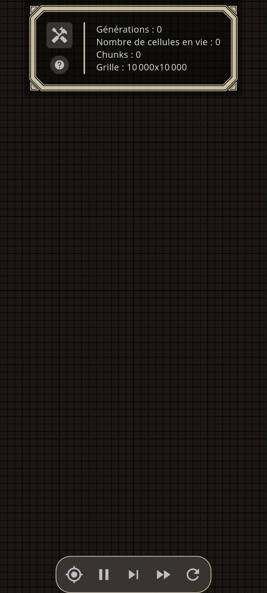
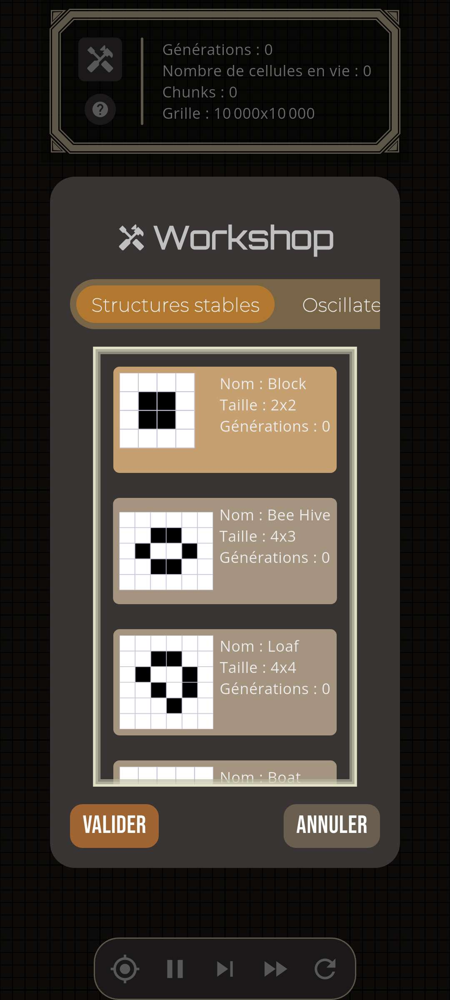
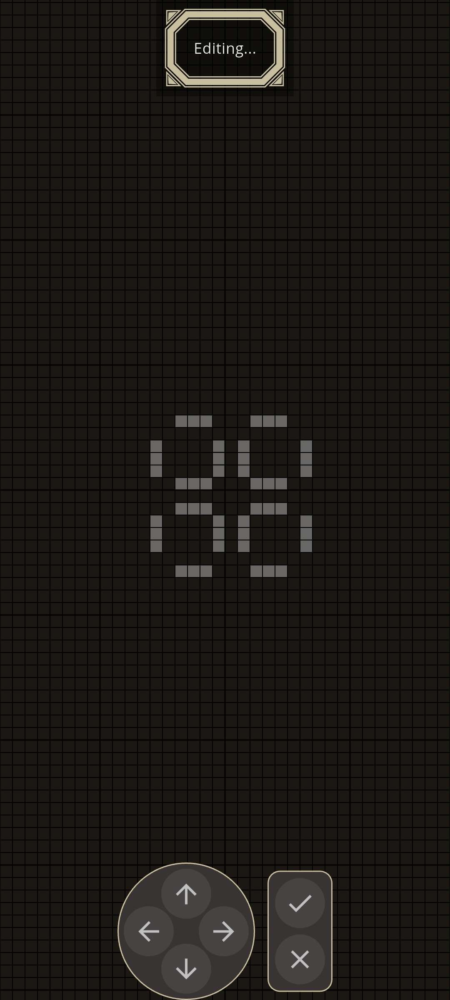
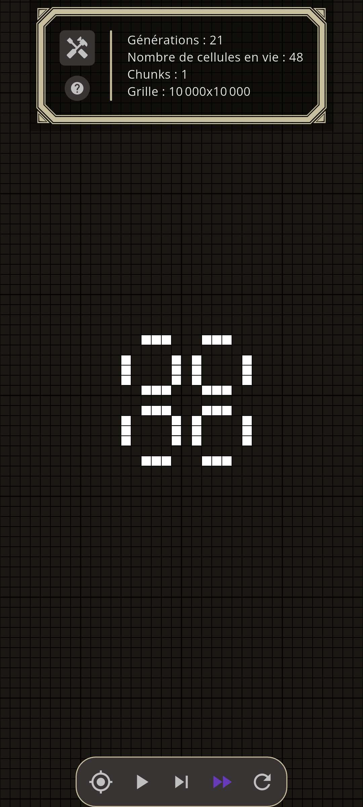
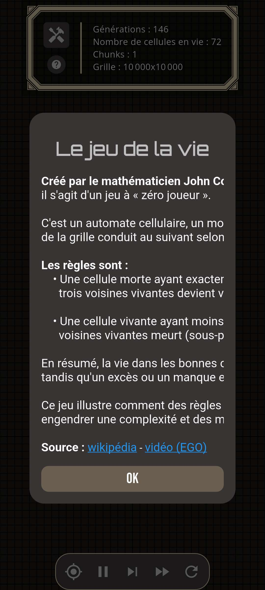

# 🧬 Game of Life

**Game of Life** est une application mobile Flutter (Android / iOS) qui permet d’explorer le **Jeu de la Vie de Conway** à travers une interface interactive, fluide et orientée “sandbox”.

> 🔁 À l’origine, ce projet devait faire partie d’une application plus large.  
> Le projet a été scindé en plusieurs apps indépendantes :  
> **Game of Life** est désormais une application dédiée uniquement à cet automate cellulaire.

---

## ✨ Fonctionnalités

- 🧠 Simulation du **Jeu de la Vie (Conway, 1970)**
- ⏯️ Pause / Lecture
- ⏩ Vitesse de génération (normal / rapide / très rapide)
- ♻️ Reset complet de la grille
- 🎯 Recentrage de la vue
- 🧩 Workshop de patterns : sélection + placement sur la grille
- 🎮 Mode édition : déplacer le pattern (D-pad) + valider / annuler
- 📊 Infos temps réel : générations, cellules vivantes, chunks, taille de grille
- ❓ Pop-up explicative (règles + liens)

---

## 📱 Captures d’écran

<p align="center">
  
  
  
  
  
</p>

---

## 🚀 Téléchargement

### 📦 Dernière version (Android APK)

Vous pouvez télécharger la dernière version stable de l’application directement via la section des **releases GitHub** :

➡️ [Télécharger l’APK – v1.0](https://github.com/IAidenI/GameOfLife/releases/download/v1/GameOfLife.apk)

> ℹ️ Pensez à autoriser l’installation d’applications provenant de sources inconnues sur votre appareil Android.

---

## 🛠️ Stack technique

- Flutter (Dart ≥ 3.0)
- Android / iOS
- UI : `CustomPainter`, widgets custom, popups
- Patterns : bibliothèque interne
- Liens externes : `url_launcher`

---

## 🧪 Lancer le projet en local

### Prérequis

- Flutter SDK
- Dart ≥ 3.0
- Android Studio / VS Code
- Un appareil ou émulateur Android / iOS

### Installation

```bash
git clone https://github.com/IAidenI/GameOfLife.git
cd GameOfLife
flutter pub get
flutter run
```